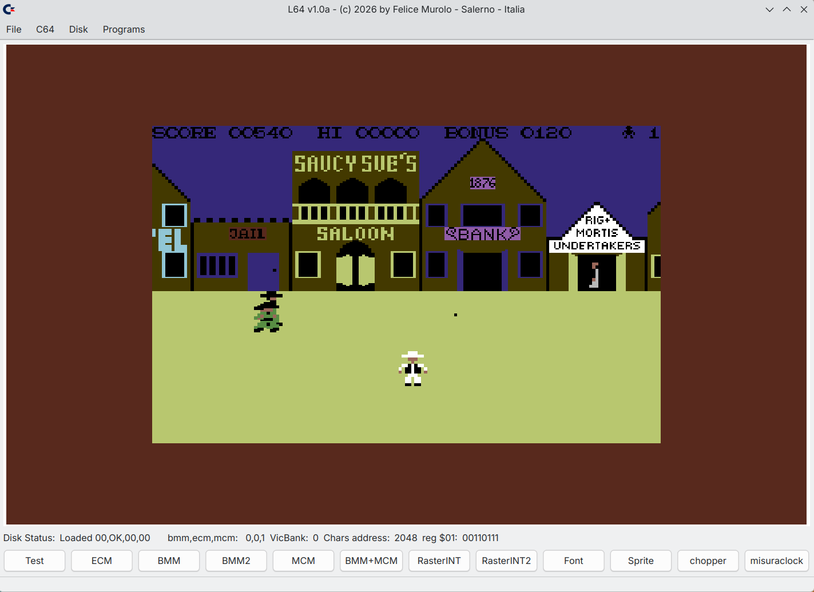

# L64
L64 - Yet Another C64 Emulator for Linux

# WARNING
L64 is in its initial state and is not to be considered a finished product.

The following features have been implemented:
- CPU emulation
- VIC emulation, with all graphics modes
- HLEDrive emulation, which is not yet perfect and complete. Supports .D64 file (also in .ZIP package)
- SID emulation
- keyboard emulation

# Dependencies
Following packages are required:  

sdl2-compat (libSDL2)

quazip-qt6 (for manage zip archives, version used: QuaZip-Qt6-1.7.2)

# COMPILATION AND RUN
Go into L64 directory and type:  

qmake

make

./L64

# ScreenShot

# Credits
Thanks you for the precious help provided to me by Gemini Google AI, in finding information and providing me with explanations on various topics.
